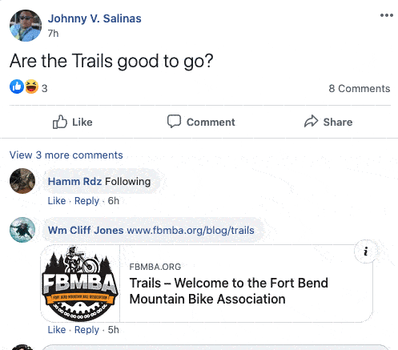

# Are The Trails Open? [GitHub license](https://img.shields.io/badge/license-MIT%20License-blue.svg)

# Live Site

https://arethetrailsopen.herokuapp.com/

## Description

`

Various mountain bike trail facebook groups are littered with users asking for the trail status. Although some people know the answers, they get frustrated by having to constantly answer the same question over and over. There are apps that have that information available, but they are flooded with too much information that makes finding the trail status quite difficult and hard to understand. Additionally it only provides you with one trails status, so you have to go through the long process again to find out the status of another trail nearby.

This application is a single paged full-stack application designed to find out whether popular biking trails in Texas are open. The user can search by their address, city/state, or zip code to find trails near them. If user allows location access, the map will automatically render in their current location. An interactive map shows the trails listed on the map with markers and also visually states whether or not the trail is open or not based on the color. When a marker is clicked, the name and address of the trail system will be displayed in an info window. User will also be given the opportunity to view the individual trails within the trail system by clicking a button inside the info window. If they click the button, a table will be rendered with all of the trail system data including individual trail data. The table allows for users to update trail status (open/closed) as well as the individual trail conditions. Because of the nature of the targeted users, this app is designed to be very mobile responsive and fully functional on even the smallest screens.

## Table of Contents

- [Installation](#installation)
- [Usage](#usage)
- [Technologies](#technologies)
- [License](#license)
- [Credits](#credits)
- [Tests](#tests)
- [Questions](#questions)

## Installation

In order to install this project, you must login to GitHub and go to github.com/iescandon/arethetrailsopen. Once there you will click on the green button that says clone or download. You will be given choices on how to download: using the ssh/html key or downloading the zip file.

Using SSH/HTML Key: You will copy the link shown and open up either terminal (mac: pre-installed) or gitbash (pc: must be installed). Once the application is open, you will type git clone _paste url here_. Once you have cloned the arethetrailsopen repo, cd into the repo and type "open ." to open the folder which contains all files used for the website. You can also type "code ." to open the repo in VS code.

Using Download ZIP: Click on Download Zip. Locate the file and double click it to unzip the file. Locate the unzipped folder and and open it. All the files for the website will be within this folder.

## Usage

Simply click on the live link listed above and use the website as normal. Type in the search bar to find nearest trails. Click on...

## Technologies

- MongoDB
- Mongoose
- Node.js
- Express.js
- React
- React Google Maps API
- Axios
- Nodemailer

## License

Copyright (c) [2020][inezescandon]
The license is MIT License.
Read more about it at https://opensource.org/licenses/MIT.

## Credits

Worked with my tutor Ivan Popov, my TA Peter Winston, and my professor Tish Mcneel .

Jumbotron photo by Andhika Soreng on Unsplash.
Marker photo by Freepik on Flaticon.com.
Favicon photo by Freepik on Flaticon.com

## Tests

No tests available.

## Questions

If you have any additional questions please contact me at iescan4@gmail.com.
GitHub: https://github.com/iescandon
